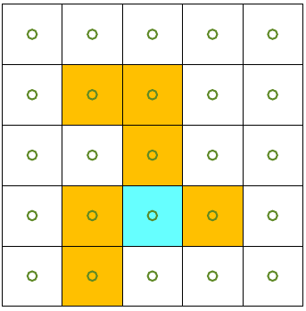
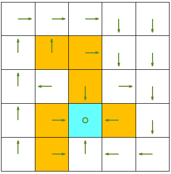
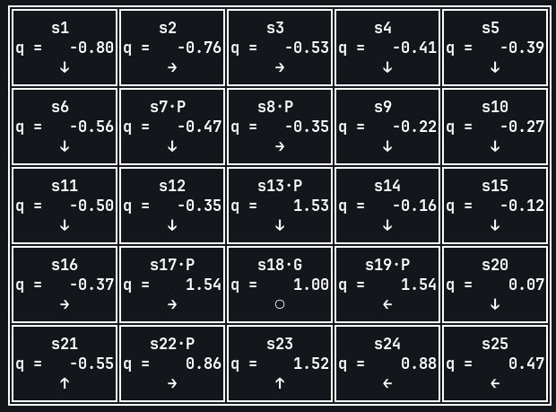

# Monte Carlo Methods in Reinforcement Learning

Three **model-free** Monte Carlo (MC) algorithms for reinforcement learning,
implemented from scratch with only Python + NumPy. No Gym, no Gymnasium.

| Algorithm                        | Branch                           |
|----------------------------------|----------------------------------|
| Monte Carlo — basic              | `monte-carlo-basic`              |
| Monte Carlo — ε-greedy           | `monte-carlo-epsilon-greedy`     |
| Monte Carlo — exploring starts   | `monte-carlo-exploring-starts`   |

All three use **every-visit** Monte Carlo.

---

## Why Monte Carlo?

Unlike the *planning* algorithms (value iteration, policy iteration), Monte
Carlo methods **do not need a model** of the environment. They learn purely
from **complete episodes** of experience: s₀, a₀, r₁, s₁, a₁, r₂, s₂, …, s_T


The idea is beautifully simple: the value of a state (or state–action pair)
is the **expected return** starting from it. So the MC estimate is just the
**average of observed returns**:

$V(s) ≈ (1 / N(s)) · Σ G_t$ over all visits to `s`\
$Q(s,a) ≈ (1 / N(s,a)) · Σ G_t$ over all visits to `(s,a)`


No Bellman operator. No iteration to a fixed point. No model. Just samples.

### Planning vs. learning

| | Planning | Learning |
|---|---|---|
| Model needed? | ✅ Yes, `T(s,a)` and `R(s,a,s')` | ❌ No |
| Data source | Bellman backups | Sampled episodes |
| Examples | Value iteration, policy iteration | Monte Carlo, TD, Q-learning |
| Bootstrapping | Yes | No (MC) / Yes (TD) |

Monte Carlo is the **purest learning method**: no bootstrapping, no model.
It waits until an episode ends, computes the return, and averages.

---

## First-visit vs. every-visit Monte Carlo

There are two ways to count visits to a state within an episode:

**First-visit MC** — only the **first** time a state (or state–action pair)
appears in an episode contributes to the average.\
episode: s₁ → s₂ → s₁ → s₃ → terminal\
`        ↑         ↑`\
`      first      ignore (second visit)`


**Every-visit MC** — every occurrence contributes.\
episode: s₁ → s₂ → s₁ → s₃ → terminal\
`         ↑        ↑`\
`       count     count too`

### Differences

| Property                | First-visit MC                              | Every-visit MC                         |
|-------------------------|---------------------------------------------|----------------------------------------|
| Estimator               | Unbiased                                    | Biased (but consistent)                |
| Variance                | Higher                                      | Lower                                  |
| Convergence (visits→∞)  | Both converge to the true value             | Both converge to the true value        |
| Data efficiency         | Lower (ignores repeated visits)             | Higher                                 |
| Complexity              | Needs a "visited" set per episode           | No bookkeeping                         |

Both are **consistent** — they converge to the true value as the number of
episodes grows. In practice they perform similarly on small problems, and
every-visit is often simpler to code.

**This repo uses every-visit MC in all three branches.**

---
the inital policy is staying for every state as follows:\


## The three algorithms

### 1. Monte Carlo — basic  →  branch `monte-carlo-basic`

The simplest MC control loop:

1. Generate an episode with exploring starts (each episode begins at a
   randomly chosen state–action pair, so every `(s, a)` has a chance to be
   sampled).
2. For each `(s, a)` in the episode, compute its return `G`.
3. Update `Q(s, a)` as the running average of returns.
4. Improve the policy greedily: $π(s) = argmax_a Q(s, a)$.
5. Repeat for many episodes.

Fully model-free but relies on exploring starts for coverage. It's the
cleanest version to read and the baseline for the two optimizations below.

**Output:**



---

### 2. Monte Carlo — ε-greedy  →  branch `monte-carlo-epsilon-greedy`

Same loop as above, but **no exploring starts**. Instead, exploration is
built directly into the policy:
$π(a | s) = 1 − ε + ε/|A|$ if $a = argmax_a Q(s, a)$
$π(a | s) = ε/|A|$ otherwise

This is **on-policy** MC: the policy used to explore is also the policy
being evaluated and improved. A small fraction `ε` of actions is always
random, guaranteeing coverage without needing special episode starts.\
\
***monte-carlo-epsilon-greedy python code needs some fixes, the agent sometimes doesn't avoid pits to access the goal.***\
\
**Output:**



---

### 3. Monte Carlo — exploring starts  →  branch `monte-carlo-exploring-starts`

The classic Sutton–Barto version. Every episode begins at a randomly chosen
`(s₀, a₀)` pair, ensuring every state–action pair is visited infinitely
often as episodes increase. Combined with greedy policy improvement, this
guarantees convergence to the optimal policy.

The key improvement over the "basic" version is **in-episode data reuse**:
the return `G` is computed **once per episode** (walking backwards from the
terminal step) and reused for every `(s, a)` in that episode, instead of
being recomputed for each state separately.

**Output:**


---

## Environment (shared by all three branches)

Hand-coded 5×5 FrozenLake:

- **Goal** : `s18 = (4, 3)` → reward `+1`
- **Pits** : `s7, s8, s13, s17, s19, s22` → reward `−10`
- **Wall bump** → reward `−1`
- **Safe move** → reward `0`
- **Actions** : `↑ = 1`, `→ = 2`, `↓ = 3`, `← = 4`, `○ = 5` (stay)
- **γ = 0.9**

Episodes terminate when the agent reaches the goal or a pit.

---

## What the three methods have in common

- **Model-free**: no `T(s, a)` or `R(s, a, s')` is ever consulted.
- **Every-visit**: every occurrence of `(s, a)` in an episode updates the
  running average.
- **Monte Carlo control**: policy evaluation and policy improvement
  alternate implicitly — the Q-table is learned from episodes, and the
  policy is derived greedily (or ε-greedily) from Q.

## What's different

| Feature             | MC basic       | MC ε-greedy     | MC exploring starts |
|---------------------|----------------|-----------------|---------------------|
| Exploration         | Exploring starts | ε-greedy       | Exploring starts    |
| Policy type         | Off-policy greedy | On-policy ε-greedy | Off-policy greedy |
| Data reuse          | No             | No              | Yes (backwards sweep) |
| Final policy        | Deterministic  | ε-noisy         | Deterministic       |
| Convergence speed   | Slowest        | Medium          | Fastest             |

---

## How to use this repo

Each algorithm lives on its own branch. Check out a branch and run the
script:

```bash
git clone git@github.com:matinnem/monte-carlo-methods-on-frozenlake.git
cd monte-carlo-methods-on-frozenlake

# Monte Carlo — basic
git checkout monte-carlo-basic
python mcBasic.py

# Monte Carlo — ε-greedy
git checkout monte-carlo-epsilon-greedy
python mcEpsilonGreedy.py

# Monte Carlo — exploring starts
git checkout monte-carlo-exploring-starts
python mcExploringStarts.py
```
Requirements: Python 3.8+ and NumPy. No Gym, no Gymnasium.
